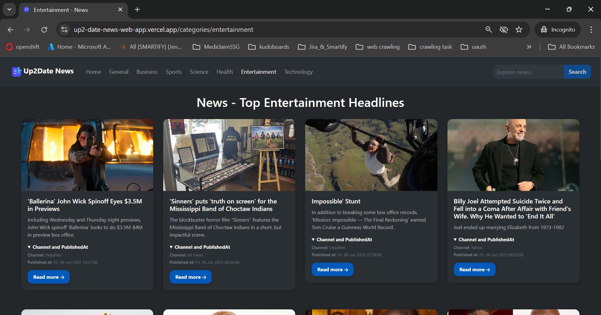
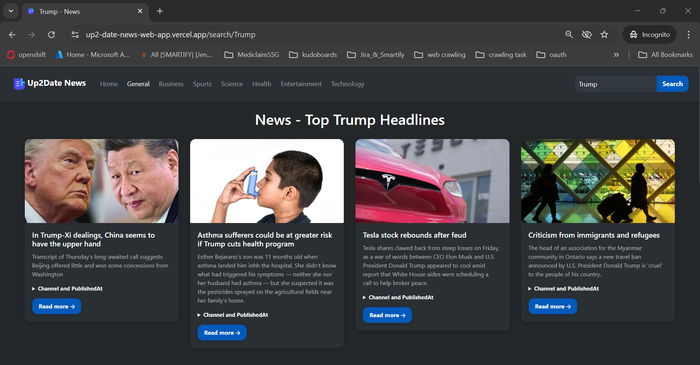

# Up2Date-News-WebApp
Up2Date News WebApp
<h1 align="center">📰 Up2Date News WebApp</h1>

<p align="center">
  <a href="https://up2-date-news-web-app.vercel.app/"><strong>Live Demo</strong></a>   •   
  <a href="https://contact-form-react-sepia.vercel.app/"><strong>Contact Me</strong></a>
</p>

<p align="center">
  
  
  
  
  
</p>

**Up2Date News WebApp** is a responsive and modern news aggregator that delivers the latest articles from around the world. Built using **React**, styled with **Styled-Components**, and powered by the **GNews public API**, it offers an intuitive way to browse, search, and read news organized by categories.

---

## ✨ Features

- 🗂️ **Category-Based News**
  - Browse news in categories like Entertainment, Business, Sports, Technology, Health, and Science.

- 🔍 **Search Functionality**
  - Easily search for specific topics or keywords to find relevant articles.

- 📰 **Article Details**
  - View article titles, descriptions, publish dates, sources, and links to the full stories.

- 📱 **Responsive Design**
  - Fully responsive layout for desktop, tablet, and mobile users.

---

## 🏗️ Project Structure

```plaintext
/public # Static assets (e.g., icons, images)
└── index.html

/src # React source code
├── /config # Configurations
├── /components # Reusable components
├── /context # Context API providers
├── /store # Redux Setup 
├── /SplashScreenAssets # For Splash Screen
├── /style # CSS styles
└── app.js # Entry point
```

---

## 🛠️ Installation

To run this project locally:

```bash
    git clone https://github.com/deepanshubajaj/Up2Date-News-WebApp.git
```
```bash
    npm install
```
```bash
    npm start   # To start the application
```

Once the development server is up and running, open your web browser and go to `http://localhost:3000` to see the project in action.

---

## Set up environment variables

Create .env file

```env
# .env file for Up2Date News web App

# GNEWS Api Key
REACT_APP_API_KEY =your_gNews_api_Key

# Other Configuration
REACT_APP_CREATOR_NAME=your_name
REACT_APP_FACEBOOK=your_facebook_url
REACT_APP_INSTAGRAM=your_instagram_url
REACT_APP_LINKEDIN=your_linkedin_url
REACT_APP_GITHUB=your_github_url
REACT_APP_TWITTER=your_twitter_url
CI=false
```

## 🛠 Technologies Used

| Technology            | Description                                           |
|-----------------------|-------------------------------------------------------|
| ⚛️ **React**           | Frontend library for building interactive UIs         |
| 🧠 **Redux**           | State management for global application data          |
| 💅 **Styled-Components** | CSS-in-JS for modular and scoped component styling    |
| 🧱 **React-Bootstrap** | UI component library for building responsive layouts  |
| 🔗 **Axios**           | For making HTTP requests to fetch news from the API   |
| 🌐 **GNews API**       | Provides real-time news articles by category and search|


---

## ⚙️ API Reference & Usage

### 🌐 GNews API


- **Source**: [https://gnews.io](https://gnews.io)
- **Purpose**: Fetches real-time news articles by category, keyword search, and language.
- **Authentication**: Requires an API key via `REACT_APP_GNEWS_API_KEY` in your `.env` file.

Example usage:
```js
axios.get(`https://gnews.io/api/v4/top-headlines?category=technology&lang=en&token=${API_KEY}`);
```

---

## 🖼️ App Icon

<p align="center">
  
</p>

<p align="center">
  *This is the App Icon.*
</p>

---

## 🖼️ Screenshots

<p align="center">
  
</p>

##

<p align="center">
  
</p>

##

<p align="center">
  
</p>

##

<p align="center">
  
</p>

##

<p align="center">
  
</p>

##

<p align="center">
  
</p>

##

<p align="center">
  
</p>

##

<p align="center">
  
</p>

##

<p align="center">
  
</p>

##

<p align="center">
  
</p>

##

<p align="center">
  
</p>

##

<p align="center">
  
</p>

##

<p align="center">
  
</p>

##

<p align="center">
  
</p>

##

<p align="center">
  
</p>

##

<p align="center">
  *Snapshots of the Running Application*
</p>

---

## 🚀 Video Demo

Here’s a short video showcasing the app's functionality:

[Watch the Working Demo](https://github.com/user-attachments/assets/abe6b86b-40ab-4711-84cb-4ce7fe1388a4)

##

➤ <a href="ProjectOutputs/WorkingVideos/WorkingVideo.mp4">🎥 Watch Working Video</a>

---

## 🤝 Contributing

Thank you for your interest in contributing to this project!  
I welcome contributions from the community.

- You are free to use, modify, and redistribute this code under the terms of the **Apache-2.0 License**.
- If you'd like to contribute, please **open an issue** or **submit a pull request**.
- All contributions will be reviewed and approved by the author — **[Deepanshu Bajaj](https://github.com/deepanshubajaj?tab=overview&from=2025-03-01&to=2025-03-31)**.

---

## 📌 How to Contribute

To contribute:

1. Fork the repository.

2. Create a new branch:
   ```bash
   git checkout -b feature/your-feature-name
   ```

3. Commit your changes:
   ```bash
   git commit -m 'Add your feature'
   ```

4. Push to the branch:
   ```bash
   git push origin feature/your-feature-name
   ```

5. Open a pull request.

---

## 📃 License

This project is licensed under the [Apache-2.0 License](./LICENSE).  
You are free to use this project for personal, educational, or commercial purposes — just make sure to provide proper attribution.

> **Clarification:** Commercial use includes, but is not limited to, use in products,  
> services, or activities intended to generate revenue, directly or indirectly.

---

## 📩 Contact

You can reach out to me [here](https://contact-form-react-sepia.vercel.app/).